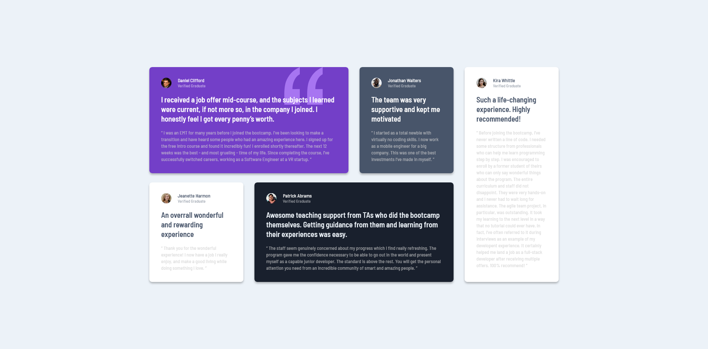

# Frontend Mentor - Testimonials grid section solution

This is a solution to the [Testimonials grid section challenge on Frontend Mentor](https://www.frontendmentor.io/challenges/testimonials-grid-section-Nnw6J7Un7). Frontend Mentor challenges help you improve your coding skills by building realistic projects.

## Table of contents

-   [Overview](#overview)
    -   [The challenge](#the-challenge)
    -   [Screenshot](#screenshot)
    -   [Links](#links)
-   [My process](#my-process)
    -   [Built with](#built-with)
-   [Author](#author)

## Overview

### The challenge

Users should be able to:

-   View the optimal layout for the site depending on their device's screen size

### Screenshot

### Links

-   Solution URL: [Github](https://github.com/Jojo25011990/testimonials-grid-section)
-   Live Site URL: [Github Pages](https://jojo25011990.github.io/testimonials-grid-section/)

## My process

### Built with

-   Semantic HTML5 markup
-   SCSS - BEM (Variables, Mixins, Loops, Maps ...)
-   Flexbox
-   CSS Grid
-   Desktop-first workflow

## Author

-   Youtube - [@web.animations.and.effects](https://www.youtube.com/@web.animations.and.effects)
-   Frontend Mentor - [@Jojo25011990](https://www.frontendmentor.io/profile/Jojo25011990)
-   Instagram - [@web.animations.and.effects](https://www.instagram.com/web.animations.and.effects)
-   Tiktok - [@web.anim.and.effects](https://www.tiktok.com/@web.anim.and.effects)
